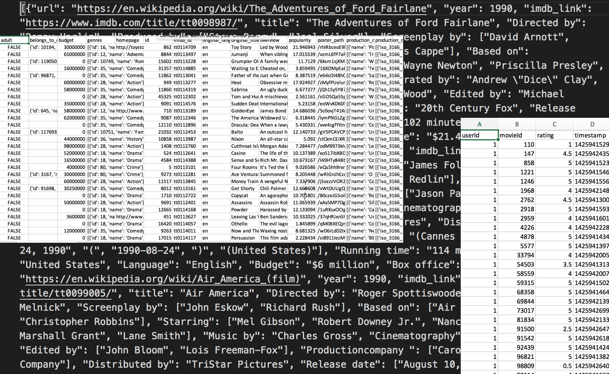
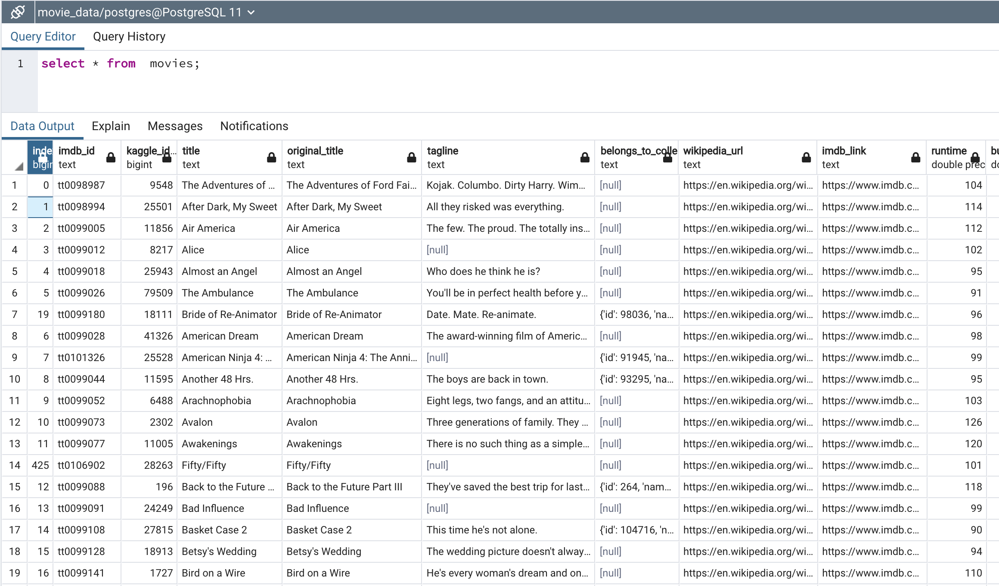

# Movies-ETL

## Overview of Project
We will be working with Amazing Prime to create a automated pipeline that accounts for new data, performs the appropriate transformations, and loads the new data into existing tables. We will create a single function that takes in multiple files and continues with the ETL process and adds the data into a database. 

## Results
### Write an ETL Function to Read Three Data Files
The ETL functions reads in the Kaggle metadata, MovieLens ratings  csv file and the Wikipedia JSON and creates DataFrames for each set of data. 

### Extract and Transform Wikipedia Data 
We used the ETL function to clean the Wiki data by filtering out TV shows, dropping duplicates, and formatting the columns and data within the DataFrame. 

### Extract and Transform the Kaggle Data 
This was similar to above, in which we filtered, dropped and formatted the data to convert into seperate DataFrames. The Kaggle metadata DataFrame and Wikipedia movies DataFrame were then mergered into one, movies_df. We then mergered this new DataFrame with the MovieLens rating data DataFrame to create movies_with_ratings_df. 

### Create the Movie Database
The final step was to add the movies_df DataFrame and MovieLens rating CSV to a SQL database. 

## Summary 
The ETL function we wrote retrieved the data from threee different sources- Kaggle file, ratings csv file and Wikipedia JSON- and both cleaned and mergered them to create a consolidated DataFrame. The function then loads the data into two SQL databases, which will be used by the team at Amazing Prime for analysis.  

